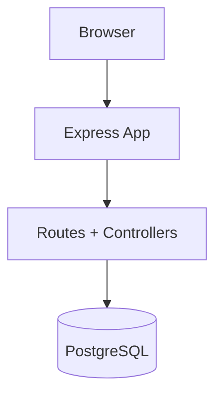

# Personal Productivity App

A personal productivity web app to track focused work sessions, categorize time usage, and generate daily/weekly insights.

## Table of Contents
- [1. Run Locally](#1-run-locally)
- [2. Project Structure](#2-project-structure)
- [3. Tech Stack](#3-tech-stack)
- [4. Developer Plugins + Commit Naming](#4-developer-plugins--commit-naming)
- [5. Branch Naming Convention](#5-branch-naming-convention)
- [6. Database Schema Diagram](#6-database-schema-diagram)
- [7. Architecture Overview](#7-architecture-overview)

## 1. Run Locally

### Setup
```bash
# 1) Install dependencies
npm install

# 2) Create a PostgreSQL database (example name)
createdb personal_productivity_app

# 3) Apply schema and seed data
psql -d personal_productivity_app -f db/schema.sql
psql -d personal_productivity_app -f db/seed.sql

# 4) Set database connection string
export DATABASE_URL="postgres://<user>:<password>@localhost:5432/personal_productivity_app"

# 5) Start the app (dev)
npm run dev
```

### Useful commands
```bash
npm run start      # run with node
npm run dev        # run with nodemon
npm run lint       # lint check
npm run lint:fix   # lint autofix
npm run format     # prettier format
```

## 2. Project Structure

```text
.
├── app.js
├── server.js
├── controllers/
├── routes/
├── views/
│   ├── index.ejs
│   └── partials/
├── db/
│   ├── schema.sql
│   └── seed.sql
└── public/
    ├── css/
    └── image/
```

### Folder purposes
- `controllers/`: Request handlers and logic.
- `routes/`: Express route definitions and route-to-controller mapping.
- `views/`: EJS templates rendered by the server.
- `views/partials/`: Reusable EJS components.
- `db/`: SQL schema and seed scripts.
- `public/`: Static frontend assets (CSS/images).

### File purposes
- `server.js`: App entrypoint, starts the HTTP server.
- `app.js`: Express app instance and middleware/router registration.
- `db/schema.sql`: PostgreSQL table definitions, constraints, and indexes.
- `db/seed.sql`: Initial categories + demo activity data.
- `eslint.config.js`: ESLint flat config.
- `.prettierrc`: Prettier formatting config.
- `.editorconfig`: Editor-level formatting defaults.

## 3. Tech Stack

- Backend: Node.js, Express.js
- Database: PostgreSQL
- Templating: EJS
- Frontend: HTML, CSS, JavaScript
- Code quality/formatting: ESLint, Prettier
- Dev tooling: Nodemon

## 4. Developer Plugins + Commit Naming

### Recommended editor plugins
- ESLint (lint diagnostics + auto-fix)
- Prettier (formatting)
- EditorConfig (consistent indentation/newlines)

### Commit naming convention (Conventional Commits)
Format:
```text
type: short summary
type(scope): short summary
```
`scope` is optional. If a clear scope is hard to define, omit it.

Examples and usage:
- `feat: add start/stop session endpoint`  
  Use for new user-facing functionality when no clear scope is needed.
- `feat(timer): add start/stop session endpoint`  
  Use for new user-facing functionality.
- `fix(categories): prevent deleting Uncategorized`  
  Use for bug fixes.
- `style(ui): normalize spacing in EJS templates`  
  Use for non-functional style changes.
- `refactor(db): extract query helpers`  
  Use for code restructuring without behavior change.
- `chore(tooling): add eslint-config-prettier`  
  Use for maintenance/tooling/config updates.
- `docs(readme): add setup and architecture sections`  
  Use for documentation-only changes.


## 5. Branch Naming Convention

Format:
```text
type/short-kebab-description
```

Examples and usage:
- `feat/project-page`  
  New feature work.
- `feat/timer-start-stop`  
  Feature for timer lifecycle.
- `test/activities-controller`  
  Test-focused work.

## 6. Database Schema Diagram


- Relationship: one `category` to many `activities`.
- Foreign key behavior: deleting a category sets child rows to default category (`id = 1`).

## 7. Architecture Overview



### Notes
- Core database design is implemented in `db/schema.sql` and `db/seed.sql`.
