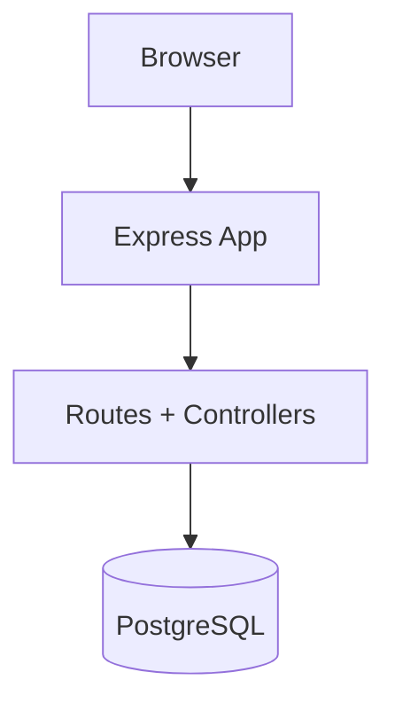

# Personal Productivity App

A personal productivity web app to track focused work sessions, categorize time usage, and generate daily/weekly insights.

## Table of Contents
- [Personal Productivity App](#personal-productivity-app)
  - [Table of Contents](#table-of-contents)
  - [1. Run Locally](#1-run-locally)
    - [Setup](#setup)
    - [Useful commands](#useful-commands)
  - [2. Team Contributions](#2-team-contributions)
    - [Wende](#wende)
    - [Jisoo](#jisoo)
    - [Yejin](#yejin)
    - [Lucie](#lucie)
  - [3. Route Map](#3-route-map)
    - [View routes](#view-routes)
    - [Action routes](#action-routes)
  - [4. Project Structure](#4-project-structure)
    - [Folder purposes](#folder-purposes)
    - [File purposes](#file-purposes)
  - [5. Tech Stack](#5-tech-stack)
  - [6. Developer Plugins + Commit Naming](#6-developer-plugins--commit-naming)
    - [Recommended editor plugins](#recommended-editor-plugins)
    - [Commit naming convention (Conventional Commits)](#commit-naming-convention-conventional-commits)
  - [7. Branch Naming Convention](#7-branch-naming-convention)
  - [8. Database Schema Diagram](#8-database-schema-diagram)
  - [9. Architecture Overview](#9-architecture-overview)
    - [Notes](#notes)
  - [10. Deploy on Render](#10-deploy-on-render)
    - [Option A (Recommended): Blueprint (`render.yaml`)](#option-a-recommended-blueprint-renderyaml)
    - [Option B: Manual Setup in Render Dashboard](#option-b-manual-setup-in-render-dashboard)
      - [Step 1: Push code to GitHub](#step-1-push-code-to-github)
      - [Step 2: Create Web Service](#step-2-create-web-service)
      - [Step 3: Set `DATABASE_URL`](#step-3-set-database_url)
      - [Step 4: Verify](#step-4-verify)
  - [11. Use Aiven PostgreSQL with Render](#11-use-aiven-postgresql-with-render)
    - [Step 1: Create Aiven PostgreSQL (Free)](#step-1-create-aiven-postgresql-free)
    - [Step 2: Copy the Aiven Service URI](#step-2-copy-the-aiven-service-uri)
    - [Step 3: Initialize schema + seed on Aiven](#step-3-initialize-schema--seed-on-aiven)
    - [Step 4: Link Aiven to Render](#step-4-link-aiven-to-render)
    - [Step 5: Redeploy and verify](#step-5-redeploy-and-verify)

## 1. Run Locally

### Setup
```bash
# 1) Install dependencies
npm install

# 2) Create PostgreSQL database
createdb -U <username> personal_productivity_app

# 3) Apply schema and seed data
psql -U <username> -d personal_productivity_app -f db/schema.sql
psql -U <username> -d personal_productivity_app -f db/seed.sql

# 4) Set database connection string
export DATABASE_URL="postgres://<username>:<password>@localhost:5432/personal_productivity_app"

# 5) Start app (dev)
npm run dev
```

Open: `http://localhost:3000`

### Useful commands
```bash
npm run start      # run with node
npm run dev        # run with nodemon
npm run lint       # lint check
npm run lint:fix   # lint autofix
npm run format     # prettier format
```

## 2. Team Contributions

### Wende
- Project repository initialization and structure design
- Database schema design and seed data preparation
- Database connection configuration and integration
- SQL queries for CRUD operations
- Render deployment configuration

### Jisoo
- Lo-fi and hi-fi screen design
- Component development and reusable layout implementation
- Workflow creation

### Yejin
- Lo-fi and hi-fi screen design
- Style guide creation
- Component and asset design

### Lucie
- Lo-fi screen design
- Frontend development (HTML, CSS, EJS, JavaScript)
- User flow creation

## 3. Route Map

### View routes
- `GET /` → Home (`index.ejs`)
- `GET /healthz` → Health check endpoint (returns `200 OK`)
- `GET /trends` → Trends Report (`trends.ejs`)
- `GET /api/trends` → Trend data JSON (day/week navigation data)
- `GET /activities/new` → New Activity (`new-activity.ejs`)
- `GET /activities/continue` → Continue Activity (`continue-activity.ejs`)
- `GET /activities/timer` → Timer (`timer.ejs`)

### Action routes
- `POST /activities` → Create activity flow (redirects to timer)
- `POST /activities/summary` → Save session and render summary
- `POST /activities/:id/delete` → Mark activity group completed (server redirect)
- `POST /activities/:id/complete` → Mark activity group completed (JSON response)
- `POST /activities/restore` → Restore activity group (set uncompleted)

## 4. Project Structure

```text
.
├── app.js
├── server.js
├── controllers/
├── routes/
├── views/
│   ├── index.ejs
│   └── partials/
├── db/
│   ├── schema.sql
│   └── seed.sql
└── public/
    ├── css/
    └── image/
```

### Folder purposes
- `controllers/`: Request handlers and DB-backed view/action logic.
- `routes/`: Express route definitions and route-to-controller mapping.
- `views/`: EJS templates rendered by the server.
- `views/partials/`: Reusable EJS components.
- `db/`: SQL schema and seed scripts.
- `public/`: Static frontend assets (CSS/images).

### File purposes
- `server.js`: App entrypoint, starts the HTTP server.
- `app.js`: Express app instance and middleware/router registration.
- `db/schema.sql`: PostgreSQL table definitions, constraints, and indexes.
- `db/seed.sql`: Initial categories + demo activity data.
- `render.yaml`: Render Blueprint config for provisioning the web service and external `DATABASE_URL`.
- `eslint.config.js`: ESLint flat config.
- `.prettierrc`: Prettier formatting config.
- `.editorconfig`: Editor-level formatting defaults.

## 5. Tech Stack

- Backend: Node.js, Express.js
- Database: PostgreSQL (`pg` / node-postgres)
- Templating: EJS
- Frontend: HTML, CSS, JavaScript
- Code quality/formatting: ESLint, Prettier
- Dev tooling: Nodemon

## 6. Developer Plugins + Commit Naming

### Recommended editor plugins
- ESLint (lint diagnostics + auto-fix)
- Prettier (formatting)
- EditorConfig (consistent indentation/newlines)

### Commit naming convention (Conventional Commits)
Format:
```text
type: short summary
type(scope): short summary
```
`scope` is optional. If a clear scope is hard to define, omit it.

Examples and usage:
- `feat: add start/stop session endpoint`  
  Use for new user-facing functionality when no clear scope is needed.
- `feat(timer): add start/stop session endpoint`  
  Use for new user-facing functionality.
- `fix(categories): prevent deleting Uncategorized`  
  Use for bug fixes.
- `style(ui): normalize spacing in EJS templates`  
  Use for non-functional style changes.
- `refactor(db): extract query helpers`  
  Use for code restructuring without behavior change.
- `chore(tooling): add eslint-config-prettier`  
  Use for maintenance/tooling/config updates.
- `docs(readme): add setup and architecture sections`  
  Use for documentation-only changes.

## 7. Branch Naming Convention

Format:
```text
type/short-kebab-description
```

Examples and usage:
- `feat/project-page`
- `feat/timer-start-stop`
- `test/activities-controller`

## 8. Database Schema Diagram


- Relationship: one `category` to many `activities`.
- Foreign key behavior: deleting a category sets child rows to default category (`id = 1`).

## 9. Architecture Overview



### Notes
- Core database design is implemented in `db/schema.sql` and `db/seed.sql`.

## 10. Deploy on Render

This project can be deployed as:
- Render Web Service (Node + Express app)
- External PostgreSQL database (Aiven recommended)

### Option A (Recommended): Blueprint (`render.yaml`)
This repo includes `render.yaml` at the project root.

1. Push your latest code to GitHub
2. In Render Dashboard, open the **Blueprints** page and click **New Blueprint Instance**
3. Connect this repository and follow the prompts
4. Render will create the web service: `personal-productivity-app`
5. Set `DATABASE_URL` in Render Dashboard to your external Postgres URI (Aiven)
6. Health check path is configured as `/healthz` (lightweight endpoint that does not depend on database queries)

### Option B: Manual Setup in Render Dashboard
#### Step 1: Push code to GitHub
Render deploys from a Git repo, so make sure this project is pushed to GitHub first.

#### Step 2: Create Web Service
1. In Render Dashboard: **New +** → **Web Service**
2. Connect this repository
3. Set:
- **Language**: `Node`
- **Build Command**: `npm install`
- **Start Command**: `npm start`

#### Step 3: Set `DATABASE_URL`
1. Open your Render web service
2. Go to **Environment**
3. Set: `DATABASE_URL=<your external Postgres URI>`

#### Step 4: Verify
- Open your Render service URL (`https://<service-name>.onrender.com`)
- Check `/healthz`, `/`, and `/activities/timer`
- If deploy fails, verify `DATABASE_URL` is set and points to the same region/account DB

## 11. Use Aiven PostgreSQL with Render

### Step 1: Create Aiven PostgreSQL (Free)
1. In Aiven Console, create a PostgreSQL service on the free plan
2. Wait until service status becomes running

### Step 2: Copy the Aiven Service URI
1. Open your Aiven PostgreSQL service
2. Copy the PostgreSQL connection URI (for example: `postgres://...?...sslmode=require`)
3. Keep this URI for both schema initialization and Render `DATABASE_URL`

### Step 3: Initialize schema + seed on Aiven
Run these from your project root on your local machine:

```bash
psql "<AIVEN_SERVICE_URI>" -f db/schema.sql
psql "<AIVEN_SERVICE_URI>" -f db/seed.sql
```

### Step 4: Link Aiven to Render
1. In Render, open your web service
2. Go to **Environment**
3. Set `DATABASE_URL` to your Aiven service URI
4. Save changes

### Step 5: Redeploy and verify
1. Trigger a redeploy in Render
2. Verify `/healthz` returns `ok`
3. Verify `/` and `/activities/timer` load successfully
