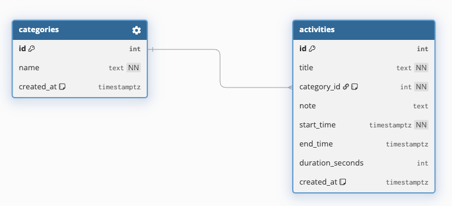
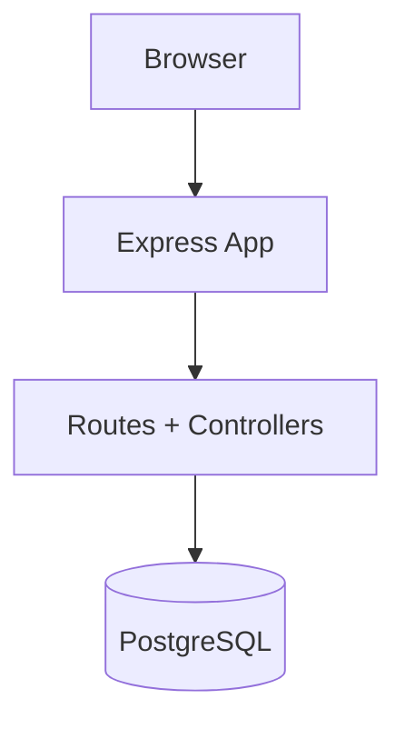

# Personal Productivity App

A personal productivity web app to track focused work sessions, categorize time usage, and generate daily/weekly insights.

## Table of Contents
- [Personal Productivity App](#personal-productivity-app)
  - [Table of Contents](#table-of-contents)
  - [1. Run Locally](#1-run-locally)
    - [Setup](#setup)
    - [Useful commands](#useful-commands)
  - [2. Route Map](#2-route-map)
    - [View routes](#view-routes)
    - [Action routes](#action-routes)
  - [3. Project Structure](#3-project-structure)
    - [Folder purposes](#folder-purposes)
    - [File purposes](#file-purposes)
  - [4. Tech Stack](#4-tech-stack)
  - [5. Developer Plugins + Commit Naming](#5-developer-plugins--commit-naming)
    - [Recommended editor plugins](#recommended-editor-plugins)
    - [Commit naming convention (Conventional Commits)](#commit-naming-convention-conventional-commits)
  - [6. Branch Naming Convention](#6-branch-naming-convention)
  - [7. Database Schema Diagram](#7-database-schema-diagram)
  - [8. Architecture Overview](#8-architecture-overview)
    - [Notes](#notes)
  - [9. Deploy on Render](#9-deploy-on-render)

## 1. Run Locally

### Setup
```bash
# 1) Install dependencies
npm install

# 2) Create PostgreSQL database
createdb -U <username> personal_productivity_app

# 3) Apply schema and seed data
psql -U <username> -d personal_productivity_app -f db/schema.sql
psql -U <username> -d personal_productivity_app -f db/seed.sql

# 4) Set database connection string
export DATABASE_URL="postgres://<username>:<password>@localhost:5432/personal_productivity_app"

# 5) Start app (dev)
npm run dev
```

Open: `http://localhost:3000`

### Useful commands
```bash
npm run start      # run with node
npm run dev        # run with nodemon
npm run lint       # lint check
npm run lint:fix   # lint autofix
npm run format     # prettier format
```

## 2. Route Map

### View routes
- `GET /` → Home (`index.ejs`)
- `GET /activities/new` → New Activity (`new-activity.ejs`)
- `GET /activities/continue` → Continue Activity (`continue-activity.ejs`)
- `GET /activities/timer` → Timer (`timer.ejs`)

### Action routes
- `POST /activities` → Create activity flow (redirects to timer)
- `POST /activities/summary` → Save session and render summary
- `POST /activities/:id/delete` → Mark activity group completed (server redirect)
- `POST /activities/:id/complete` → Mark activity group completed (JSON response)
- `POST /activities/restore` → Restore activity group (set uncompleted)

## 3. Project Structure

```text
.
├── app.js
├── server.js
├── controllers/
├── routes/
├── views/
│   ├── index.ejs
│   └── partials/
├── db/
│   ├── schema.sql
│   └── seed.sql
└── public/
    ├── css/
    └── image/
```

### Folder purposes
- `controllers/`: Request handlers and DB-backed view/action logic.
- `routes/`: Express route definitions and route-to-controller mapping.
- `views/`: EJS templates rendered by the server.
- `views/partials/`: Reusable EJS components.
- `db/`: SQL schema and seed scripts.
- `public/`: Static frontend assets (CSS/images).

### File purposes
- `server.js`: App entrypoint, starts the HTTP server.
- `app.js`: Express app instance and middleware/router registration.
- `db/schema.sql`: PostgreSQL table definitions, constraints, and indexes.
- `db/seed.sql`: Initial categories + demo activity data.
- `eslint.config.js`: ESLint flat config.
- `.prettierrc`: Prettier formatting config.
- `.editorconfig`: Editor-level formatting defaults.

## 4. Tech Stack

- Backend: Node.js, Express.js
- Database: PostgreSQL (`pg` / node-postgres)
- Templating: EJS
- Frontend: HTML, CSS, JavaScript
- Code quality/formatting: ESLint, Prettier
- Dev tooling: Nodemon

## 5. Developer Plugins + Commit Naming

### Recommended editor plugins
- ESLint (lint diagnostics + auto-fix)
- Prettier (formatting)
- EditorConfig (consistent indentation/newlines)

### Commit naming convention (Conventional Commits)
Format:
```text
type: short summary
type(scope): short summary
```
`scope` is optional. If a clear scope is hard to define, omit it.

Examples and usage:
- `feat: add start/stop session endpoint`  
  Use for new user-facing functionality when no clear scope is needed.
- `feat(timer): add start/stop session endpoint`  
  Use for new user-facing functionality.
- `fix(categories): prevent deleting Uncategorized`  
  Use for bug fixes.
- `style(ui): normalize spacing in EJS templates`  
  Use for non-functional style changes.
- `refactor(db): extract query helpers`  
  Use for code restructuring without behavior change.
- `chore(tooling): add eslint-config-prettier`  
  Use for maintenance/tooling/config updates.
- `docs(readme): add setup and architecture sections`  
  Use for documentation-only changes.

## 6. Branch Naming Convention

Format:
```text
type/short-kebab-description
```

Examples and usage:
- `feat/project-page`
- `feat/timer-start-stop`
- `test/activities-controller`

## 7. Database Schema Diagram



- Relationship: one `category` to many `activities`.
- Foreign key behavior: deleting a category sets child rows to default category (`id = 1`).

## 8. Architecture Overview



### Notes
- Core database design is implemented in `db/schema.sql` and `db/seed.sql`.

## 9. Deploy on Render

This project can be deployed as:
- 1 Render Web Service (Node + Express app)
- 1 Render PostgreSQL database

### Option A (Recommended): Blueprint (`render.yaml`)
This repo includes `render.yaml` at the project root.

1. Push your latest code to GitHub
2. In Render Dashboard, open the **Blueprints** page and click **New Blueprint Instance**
3. Connect this repository and follow the prompts
4. Render will create both:
- Web Service: `personal-productivity-app`
- PostgreSQL: `personal-productivity-db`
5. `DATABASE_URL` is auto-wired from the database `connectionString` (internal DB URL) via Blueprint

### Option B: Manual Setup in Render Dashboard
### Step 1: Push code to GitHub
Render deploys from a Git repo, so make sure this project is pushed to GitHub first.

### Step 2: Create PostgreSQL on Render
1. In Render Dashboard: **New +** → **PostgreSQL**
2. Choose a name/region and create it.
3. Open DB **Info** page and copy:
- `Internal Database URL` (for your web service `DATABASE_URL`)
- `External Database URL` (for one-time schema/seed import from local machine)

### Step 3: Create Web Service
1. In Render Dashboard: **New +** → **Web Service**
2. Connect this repository
3. Set:
- **Language**: `Node`
- **Build Command**: `npm install`
- **Start Command**: `npm start`
- **Environment Variable**: `DATABASE_URL=<your Internal Database URL>`

This project now reads:
- `PORT` from `process.env.PORT` (required for Render)
- `DATABASE_URL` from environment variables

### Step 4: Initialize database schema + seed data (one-time)
Run these on your local machine (with `psql` installed), using the DB's **External Database URL**:

```bash
psql "<EXTERNAL_DATABASE_URL>" -f db/schema.sql
psql "<EXTERNAL_DATABASE_URL>" -f db/seed.sql
```

If your web service started before schema/seed was applied, trigger a manual redeploy (or restart) once.

### Step 5: Verify
- Open your Render service URL (`https://<service-name>.onrender.com`)
- Check `/` and `/activities/timer`
- If deploy fails, verify `DATABASE_URL` is set and points to the same region/account DB
